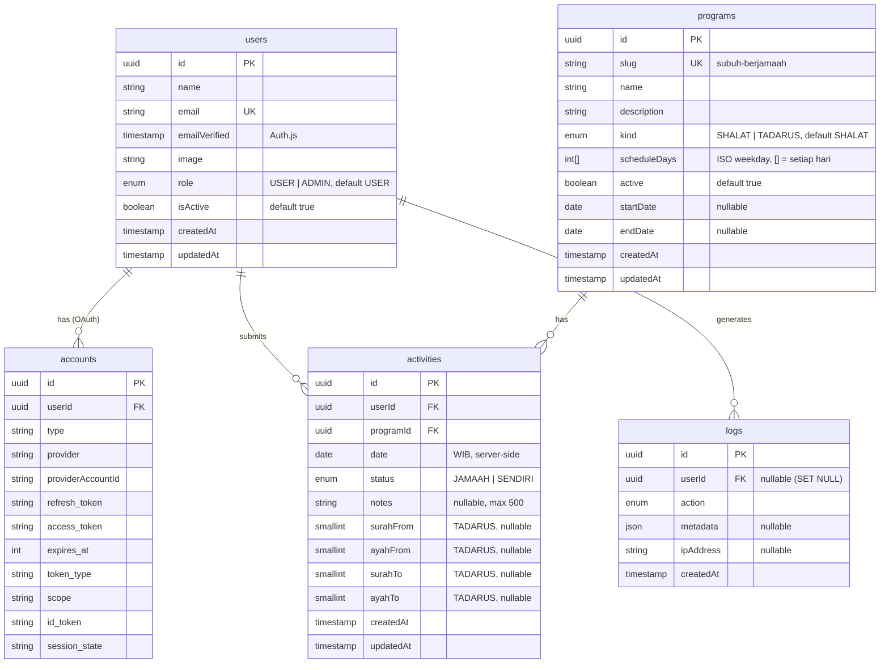
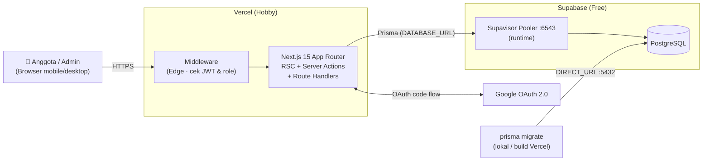
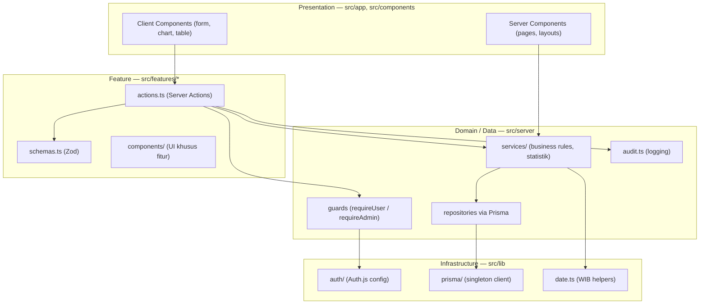
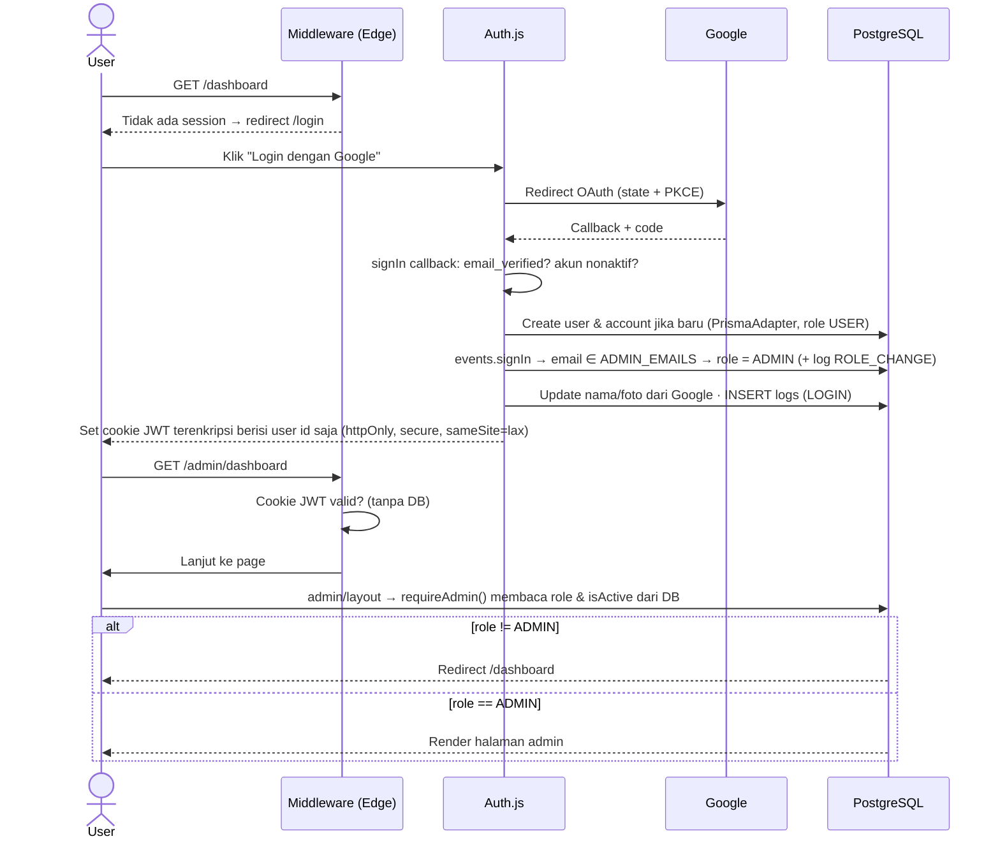
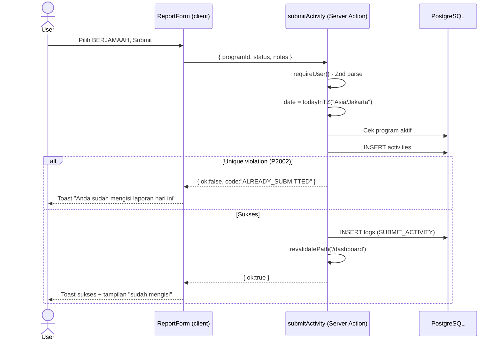

# Habit Assic — Analysis & Architecture

> Phase 1 deliverable. Dokumen ini menjadi acuan untuk Phase 2–10.
> Status: **Draft untuk disetujui** · Tanggal: 27 September 2026

---

## 1. Analisa Requirement

### 1.1 Aktor

| Aktor | Deskripsi | Cara jadi aktor |
|---|---|---|
| **USER** | Anggota asrama | Login Google pertama kali → otomatis dibuat dengan role `USER` |
| **ADMIN** | Management/pengurus asrama | Email terdaftar di env `ADMIN_EMAILS` (bootstrap), atau dipromosikan oleh ADMIN lain |

### 1.2 Functional Requirements

| ID | Requirement | Aktor | Phase |
|---|---|---|---|
| F-01 | Login dengan Google OAuth; user baru otomatis dibuat, role default `USER` | Semua | 4 |
| F-02 | Dashboard user: foto & nama Google, daftar program aktif, tombol "Isi Laporan Subuh Hari Ini" | USER | 5 |
| F-03 | Form laporan: tanggal otomatis hari ini (WIB), pilihan `BERJAMAAH` / `SENDIRI`, catatan opsional | USER | 5 |
| F-04 | Satu laporan per user, per program, per tanggal. Jika sudah ada → "Anda sudah mengisi laporan hari ini" | USER | 5 |
| F-05 | Statistik bulan berjalan: total hari, berjamaah, sendiri, belum isi, persentase; progress circle, chart, kalender | USER | 5 |
| F-06 | Riwayat ibadah pribadi (per bulan) | USER | 5 |
| F-07 | Admin dashboard `/admin/dashboard`: total anggota, sudah input, belum input, berjamaah, sendiri (hari ini) | ADMIN | 6 |
| F-08 | Tabel monitoring anggota: nama, total input, jamaah, sendiri, persentase; search, filter bulan, pagination, sorting | ADMIN | 6 |
| F-09 | Detail anggota: nama + riwayat `Tanggal | Status` | ADMIN | 6 |
| F-10 | Kelola program: tambah, ubah, aktif/nonaktif | ADMIN | 6 |
| F-11 | Export CSV: nama, jumlah jamaah, jumlah sendiri, persentase (sesuai filter bulan) | ADMIN | 6 |
| F-12 | Audit log: `LOGIN`, `SUBMIT_ACTIVITY` (ditambah aksi admin: `EXPORT_CSV`, `PROGRAM_*`, `ROLE_CHANGE`) | Sistem | 4–6 |
| F-13 | Kelola role anggota (promote/demote ADMIN) — pelengkap F-10 agar admin tidak bergantung pada env | ADMIN | 6 |
| F-14 | **Tadarus Qur'an**: admin memilih jenis program *Tadarus* dan jadwal hari dalam sepekan (default Senin); anggota mengisi bacaan *dari surah:ayat sampai surah:ayat*. Beranda menampilkan sesi berikutnya dan progres menuju khatam; admin melihat bacaan tiap anggota per sesi. | Semua | 11 |

### 1.3 Non-Functional Requirements

| Kategori | Requirement |
|---|---|
| UX | Mobile-first, bottom navigation di mobile, sidebar di desktop; loading, empty, dan error state; toast |
| Design | "Modern Islamic SaaS Dashboard": background putih, primary soft green, rounded card, shadow ringan, spacing lega |
| Security | Auth middleware, otorisasi berbasis role di server (bukan hanya UI), validasi Zod, secret di env |
| Integritas data | Unique constraint di level DB (bukan hanya pengecekan di aplikasi) |
| Performa | Agregasi statistik di DB (`groupBy`/`count`), pagination di server, index pada kolom query |
| Biaya | Harus muat di Vercel Hobby + Supabase Free (500 MB DB, koneksi terbatas → pakai pooler) |
| Extensibility | Skema generik untuk program lain (Tahajud, Puasa, Tilawah, Kajian, Hafalan) |

### 1.4 Business Rules & Keputusan Desain

Aturan berikut tidak disebut eksplisit di brief. Saya tetapkan default di bawah; koreksi sebelum Phase 2 jika tidak sesuai.

| # | Aturan | Alasan |
|---|---|---|
| BR-1 | **Zona waktu `Asia/Jakarta` (WIB)** untuk semua perhitungan "hari ini" dan bulan. Bisa diubah lewat env `APP_TIMEZONE`. | Server Vercel berjalan di UTC. Tanpa ini, laporan jam 04:30 WIB tercatat sebagai tanggal kemarin. |
| BR-2 | `activities.date` disimpan sebagai `DATE` (tanpa jam), dihitung di server, **tidak pernah diterima dari client**. | Mencegah user mengisi tanggal lampau/masa depan lewat manipulasi request. |
| BR-3 | User **tidak bisa backfill** hari yang terlewat dan **tidak bisa mengubah** laporan yang sudah dikirim. | Sesuai brief ("tanggal otomatis hari ini"; "sudah mengisi" → berhenti). Menjaga kejujuran data. |
| BR-4 | **Persentase = Jamaah ÷ Hari efektif × 100**, dibulatkan. Contoh brief: 25 ÷ 30 = 83%. | Sesuai contoh di brief. |
| BR-5 | **Hari efektif** = hari dari `max(awal bulan, tanggal user bergabung, tanggal mulai program)` sampai `min(akhir bulan, hari ini)`. | Anggota yang baru bergabung tanggal 20 tidak dianggap "belum isi" untuk tanggal 1–19. Hari yang belum tiba tidak dihitung. |
| BR-6 | **Belum isi** = Hari efektif − (Jamaah + Sendiri). **Hari ini hanya dihitung setelah dilaporkan**; sebelum itu statusnya "Hari ini" (belum terlewat). | Konsisten dengan contoh: 30 = 25 + 4 + 1. Hari ini belum berakhir, jadi tidak adil dihitung "belum isi" pukul 03:00 sebelum Subuh. |
| BR-7 | "Total hari" pada kartu statistik = jumlah hari di bulan tersebut; progres dihitung terhadap hari efektif. | Kartu menampilkan konteks bulan; angka persentase tetap adil. |
| BR-12 | **Streak** = jumlah hari JAMAAH berturut-turut sampai hari ini (atau kemarin jika hari ini belum diisi). SENDIRI atau hari kosong memutus streak. | Motivasi istiqamah tanpa menghukum anggota yang belum sempat mengisi pagi ini. |
| BR-8 | Tombol laporan hanya aktif untuk program dengan `active = true`. Program nonaktif tetap tampil di riwayat. | Riwayat tidak boleh hilang saat program ditutup. |
| BR-9 | Admin pertama di-bootstrap via env `ADMIN_EMAILS` (dipisah koma); dicek setiap login. | Menghindari akses manual ke database hanya untuk membuat admin pertama. |
| BR-10 | ADMIN juga bisa mengisi laporan (admin bisa sekaligus anggota asrama). Admin tidak bisa men-demote dirinya sendiri. | Mencegah sistem kehilangan semua admin. |
| BR-13 | **Jadwal mingguan** (`programs.scheduleDays`, ISO 1 = Senin … 7 = Ahad; kosong = setiap hari). Laporan hanya diterima pada hari terjadwal; hari di luar jadwal berstatus `OFF` dan tidak dihitung sebagai hari efektif maupun "belum isi". | Tadarus hanya Senin: anggota tidak boleh dianggap bolos pada hari Selasa–Ahad. |
| BR-14 | **Jenis program** (`SHALAT` / `TADARUS`) tetap setelah dibuat, seperti slug. Program Shalat menerima `JAMAAH`/`SENDIRI` tanpa bacaan; Tadarus menerima `HADIR` + bacaan lengkap. Persentase Tadarus = sesi hadir ÷ sesi terjadwal. BR-2/BR-3 tetap berlaku (tanggal dari server, tanpa backfill/ubah). | Bentuk setiap laporan bergantung pada jenis; mengubahnya akan merusak riwayat. |
| BR-15 | **Bacaan** disimpan sebagai rentang inklusif `surahFrom:ayahFrom → surahTo:ayahTo` (boleh lintas surah). Jumlah ayat, juz, dan progres khatam dihitung dari data statis mushaf (114 surah, 6.236 ayat) di `src/features/tadarus/lib/quran.ts`. Form otomatis melanjutkan dari ayat setelah bacaan terakhir. Progres khatam = posisi akhir bacaan terakhir ÷ 6.236; bacaan yang sampai An-Nas 6 dihitung 1× khatam. | Tanpa tabel master surah: data mushaf tidak pernah berubah. |
| BR-11 | Anggota yang dihitung di statistik admin = user dengan role `USER` **dan** `ADMIN` yang aktif (`isActive = true`). Admin dapat menonaktifkan anggota yang sudah keluar asrama. | Anggota alumni tidak boleh merusak persentase "belum input". |

---

## 2. ERD Database

Prinsip: **Program Management System**. `programs` bersifat generik, `activities` mencatat partisipasi apa pun. Subuh hanyalah satu baris di `programs`.



### 2.1 Constraint & Index

| Tabel | Constraint / Index | Tujuan |
|---|---|---|
| `users` | `UNIQUE(email)` | Satu akun per email Google |
| `accounts` | `UNIQUE(provider, providerAccountId)`, `INDEX(userId)`, FK `userId → users.id ON DELETE CASCADE` | Syarat Auth.js adapter |
| `programs` | `UNIQUE(slug)`, `INDEX(active)` | Lookup stabil di URL (`/report/subuh-berjamaah`) |
| `activities` | **`UNIQUE(userId, programId, date)`** | **Aturan inti: 1 laporan / user / program / hari** — dijaga DB, jadi tahan race condition (double-tap submit) |
| `activities` | `INDEX(programId, date)` | Admin: "siapa yang sudah input hari ini" & agregasi bulanan |
| `activities` | *(dicakup oleh unique di atas)* | Riwayat & statistik user selalu memfilter `userId + programId + rentang date`, yaitu prefix dari unique index. Index `(userId, date)` terpisah jadi redundan dan **tidak dibuat**. |
| `programs` | `CHECK (end_date >= start_date)` | Rentang program valid |
| `programs` | `CHECK (schedule_days <@ {1..7})` | Jadwal hanya berisi hari ISO |
| `activities` | `CHECK` bacaan lengkap (4 kolom terisi semua atau kosong semua) & tidak mundur (`(surah_to, ayah_to) >= (surah_from, ayah_from)`, surah 1–114) | Integritas bacaan Tadarus; batas ayat per surah divalidasi Zod |
| Semua tabel | **Row Level Security aktif, tanpa policy** | Menutup Supabase Data API (PostgREST, role `anon`/`authenticated`). Prisma terhubung sebagai owner tabel sehingga tidak terpengaruh. Migration `security_hardening`. |
| `activities` | FK `userId → users ON DELETE CASCADE`, FK `programId → programs ON DELETE RESTRICT` | Program yang punya data tidak bisa dihapus (harus dinonaktifkan) |
| `logs` | `INDEX(userId, createdAt)`, `INDEX(action, createdAt)`, FK `userId → users ON DELETE SET NULL` | Audit log tetap ada walau user dihapus |

### 2.2 Enum

```text
Role           : USER, ADMIN
ProgramKind    : SHALAT, TADARUS
ActivityStatus : JAMAAH, SENDIRI, HADIR
LogAction      : LOGIN, SUBMIT_ACTIVITY, EXPORT_CSV,
                 PROGRAM_CREATE, PROGRAM_UPDATE, ROLE_CHANGE, USER_STATUS_CHANGE
```

Label UI "BERJAMAAH" dipetakan ke nilai enum `JAMAAH`.

### 2.3 Jalur Ekstensi untuk Program Lain

| Program masa depan | Yang dibutuhkan | Perubahan skema |
|---|---|---|
| Tahajud, Kajian | Status ya/tidak | Tambah nilai enum `HADIR` / `TIDAK_HADIR` (1 migration) + `programs.statusOptions` |
| Puasa | Status ya/tidak per hari | Sama seperti di atas |
| Tilawah, Hafalan | Surah & ayat | ✅ Sudah tersedia lewat jenis `TADARUS` (kolom bacaan) |

Tabel, relasi, unique constraint, statistik, dan halaman admin **tidak berubah**. Semua query sudah memfilter berdasarkan `programId`.
Kolom `statusOptions` dan `value` sengaja **belum** dibuat sekarang (YAGNI). Skema saat ini sudah bisa menampungnya tanpa refactor.

---

## 3. Architecture Diagram

### 3.1 System Context



### 3.2 Layered Architecture (di dalam Next.js)



Aturan dependensi: `app → features → server → lib`. Komponen UI **tidak pernah** mengimpor Prisma langsung. File di `src/server` diberi `import "server-only"` agar tidak bisa bocor ke bundle client.

### 3.3 Alur Autentikasi & Otorisasi



Keputusan penting (final setelah Phase 4):
- **Session strategy JWT**, bukan database session. Middleware Next.js 15 berjalan di Edge runtime, dan Prisma tidak bisa dipakai di sana. JWT bisa diverifikasi di Edge tanpa DB.
- Konfigurasi Auth.js dipecah menjadi `auth.config.ts` (edge-safe, dipakai middleware) dan `auth.ts` (lengkap dengan PrismaAdapter).
- **JWT hanya berisi user id; role tidak disimpan di token.** Middleware hanya memastikan user sudah login. Halaman tanpa session di-redirect ke `/login?callbackUrl=…`, dan `/api/*` mendapat `401`. **Otorisasi role** ada di layout `/admin`, setiap Server Action, dan Route Handler lewat `requireAdmin()` / `assertAdmin()`, yang membaca role & `isActive` dari DB (satu query per request, di-cache dengan React `cache`). Akibatnya:
  - admin yang baru dipromosikan langsung bisa masuk tanpa login ulang;
  - role yang dicabut atau akun yang dinonaktifkan langsung berlaku, tanpa menunggu JWT kedaluwarsa.
- Token OAuth Google (**access/refresh/id token**) **tidak disimpan** di tabel `accounts` (callback `account()` provider). Aplikasi hanya butuh identitas, jadi kebocoran DB tidak membocorkan akses ke akun Google.
- `callbackUrl` disanitasi oleh `safeRedirectPath()` agar tidak bisa dipakai untuk open redirect.

### 3.4 Alur Submit Laporan



---

## 4. Route Map

| Route | Akses | Isi |
|---|---|---|
| `/` | Publik | Redirect ke `/dashboard` atau `/login` |
| `/login` | Publik | Tombol "Login dengan Google" |
| `/dashboard` | USER, ADMIN | Profil, kartu program aktif, status hari ini, ringkasan bulan |
| `/dashboard/report/[slug]` | USER, ADMIN | Form laporan hari ini (Shalat: status; Tadarus: surah & ayat). Di luar jadwal: info sesi berikutnya |
| `/dashboard/stats` | USER, ADMIN | Progress circle, chart, kalender bulanan (pilih bulan) |
| `/dashboard/history` | USER, ADMIN | Riwayat per bulan |
| `/admin/dashboard` | ADMIN | Statistik hari ini + tren |
| `/admin/members` | ADMIN | Tabel monitoring (search, filter bulan, sort, pagination via URL search params) |
| `/admin/members/[id]` | ADMIN | Detail anggota + riwayat + ubah role/status |
| `/admin/programs` | ADMIN | CRUD program |
| `/api/auth/[...nextauth]` | Publik | Handler Auth.js |
| `/api/admin/export` | ADMIN | Route Handler → `text/csv` |

State tabel admin (search, bulan, halaman, sort) disimpan di **URL search params**. Tujuannya agar bisa di-bookmark dan dibagikan, tetap tersimpan saat refresh, dan dirender di server tanpa client fetching.

Bottom navigation (mobile): **Beranda · Lapor · Statistik · Riwayat** (+ **Admin** jika ADMIN).

---

### 4.1 Catatan Implementasi Admin (Phase 6)

| Topik | Keputusan |
|---|---|
| Perhitungan monitoring | Satu query anggota + satu query aktivitas bulan itu, lalu dihitung di aplikasi dengan `computeMonthlyStats` yang **sama** dengan halaman anggota. Angka admin dan anggota selalu identik. Nyaman untuk ribuan anggota; di atas itu dapat dipindah ke SQL agregat. |
| Search / sort / filter / halaman | Disimpan di URL: `?program=&month=&q=&sort=&dir=&status=&page=`, divalidasi Zod dengan fallback aman. 20 baris per halaman. |
| Anggota yang dihitung | User aktif (`isActive`), role USER maupun ADMIN (BR-11), mulai dari tanggal bergabung. |
| Ubah role / status | Admin tidak bisa mengubah akunnya sendiri. Admin aktif terakhir tidak bisa di-demote atau dinonaktifkan (`LAST_ADMIN`). Setiap perubahan tercatat (`ROLE_CHANGE`, `USER_STATUS_CHANGE`). |
| Program | Slug tidak dapat diubah setelah dibuat (bagian dari URL anggota). Program yang punya laporan tidak dapat dihapus (FK `RESTRICT`), hanya dinonaktifkan. |
| Export CSV | `GET /api/admin/export` mengikuti filter tabel. Kolom: Nama, Email, Jumlah Jamaah, Jumlah Sendiri, Belum Isi, Total Input, Hari Terhitung, Persentase. UTF-8 dengan BOM, pemisah koma (RFC 4180), sel diawali `= + - @` di-escape (anti formula injection). Tercatat sebagai `EXPORT_CSV`. |
| Transaksi & audit | Log audit ditulis **setelah** transaksi commit. Pool koneksi kecil (`connection_limit`), sehingga query di luar `tx` di dalam transaksi bisa menunggu koneksi yang tidak pernah bebas (deadlock bila limit = 1). |

### 4.2 Standar UI & Aksesibilitas (Phase 7)

| Area | Standar yang diterapkan & diverifikasi |
|---|---|
| Kontras | Semua teks ≥ 4,5:1 (WCAG 2.1 AA). `--primary` = `oklch(0.52 0.105 160)` (5,2:1 di atas putih). Diverifikasi dengan axe-core di 9 halaman, lebar 360px & 1280px: **0 pelanggaran**. |
| Responsif | Tanpa scroll horizontal di 360 / 768 / 1280px. Tabel monitoring ringkas (Nama · Input · %) di bawah `lg`. Bottom nav di mobile, sidebar mulai `md`. |
| Sentuh | Target sentuh ≥ 40–44px di mobile (pemilih bulan, pagination, bottom nav 64px). |
| Keyboard & pembaca layar | Link "Lewati ke konten" sebagai fokus pertama. `aria-current` di navigasi. Kalender = daftar tanggal dengan label lengkap. Status selalu ikon + teks. |
| Gerak | `prefers-reduced-motion` dihormati (progress ring, indikator navigasi). |
| State | Skeleton per halaman (bentuk sama dengan konten), empty state, `error.tsx` per area + `global-error.tsx`, 404 bermerek. |
| Jaringan | Aksi gagal karena koneksi, lalu toast "Tidak dapat terhubung…", dan tombol aktif kembali. Tidak ada data setengah jadi (diuji offline, lalu retry). |
| Navigasi query | Halaman dengan navigasi `?month=`, `?page=`, `?sort=`, `?q=`, `?program=` (statistik, riwayat, semua halaman admin) **tidak boleh** dibungkus `loading.tsx` di segmennya maupun induknya. Di build production Next.js 15.5, navigasi query di route yang sama tidak pernah commit bila ada boundary tersebut (ditemukan & diisolasi di Phase 8). Umpan balik loading diberikan per link lewat `LinkPending` (`useLinkStatus`). Skeleton hanya dipakai di beranda (`dashboard/(home)`), form laporan, dan halaman program. Dijaga 5 test regresi E2E yang **mengklik** link. |
| Prefetch | Link per anggota (20 per halaman) memakai `prefetch={false}` agar tidak memicu 20 render server setiap kali halaman dibuka. |
| Instal ke HP | `manifest.webmanifest`, ikon 192/512 + maskable, apple-touch-icon, `theme-color`. |
| Privasi | `robots.txt` `Disallow: /` + meta `noindex, nofollow`. |

### 4.3 Deployment (Phase 9)

| Topik | Keputusan |
|---|---|
| Region | Production: Supabase **ap-southeast-1 (Singapura)** + Vercel **sin1**, latensi ± 15–30 ms dari Indonesia. Database dev tetap di Seoul. Region Vercel wajib sama dengan region DB (`vercel.json`). |
| Migration | `scripts/vercel-build.mjs`: `prisma migrate deploy` + seed idempotent **hanya** saat `VERCEL_ENV=production`. Build Preview tidak menyentuh schema. |
| Koneksi | Runtime: Transaction pooler 6543 (`pgbouncer=true&connection_limit=5`). Migration: Session pooler 5432 (Direct connection Supabase Free hanya IPv6). |
| Auth di Vercel | `AUTH_URL` tidak di-set (host terdeteksi otomatis). `AUTH_SECRET` production berbeda dari lokal. Cookie otomatis `__Secure-`/`Secure` di HTTPS. |
| Quality gate | **Pre-push hook lokal** (`.githooks/pre-push` → `npm run verify`: lint, typecheck, Prettier, unit test). Push dibatalkan kalau gagal. Diaktifkan otomatis oleh `npm install` (`prepare`), no-op di Vercel. Build Vercel mengulang lint + typecheck. Integration/E2E (butuh DB dev) dijalankan lokal dengan `npm run test:all`. GitHub Actions sengaja tidak dipakai (akun terkena pembatasan billing Actions; hook memberi jaminan yang sama tanpa biaya). |
| Verifikasi | `npm run smoke -- <url>`: 20 cek read-only (redirect, 401, header keamanan, cookie Secure, callback OAuth, aset PWA). |

## 5. Folder Structure

```text
asramamonitoring/
├─ prisma/
│  ├─ schema.prisma
│  ├─ migrations/
│  └─ seed.ts                     # Program "Subuh Berjamaah" (data master, bukan dummy)
├─ public/
├─ docs/
│  ├─ ARCHITECTURE.md             # dokumen ini
│  ├─ TESTING.md                  # Phase 8
│  └─ DEPLOYMENT.md               # Phase 9
├─ src/
│  ├─ app/
│  │  ├─ layout.tsx               # font, Toaster, metadata
│  │  ├─ page.tsx                 # redirect
│  │  ├─ globals.css              # design tokens (soft green)
│  │  ├─ login/page.tsx
│  │  ├─ dashboard/
│  │  │  ├─ layout.tsx            # AppShell + BottomNav
│  │  │  ├─ (home)/page.tsx · (home)/loading.tsx · error.tsx
│  │  │  ├─ report/[slug]/page.tsx
│  │  │  ├─ stats/page.tsx
│  │  │  └─ history/page.tsx
│  │  ├─ admin/
│  │  │  ├─ layout.tsx            # requireAdmin()
│  │  │  ├─ dashboard/page.tsx
│  │  │  ├─ members/page.tsx
│  │  │  ├─ members/[id]/page.tsx
│  │  │  └─ programs/page.tsx
│  │  ├─ api/
│  │  │  ├─ auth/[...nextauth]/route.ts
│  │  │  └─ admin/export/route.ts
│  │  └─ not-found.tsx
│  ├─ components/
│  │  ├─ ui/                      # shadcn (button, card, table, ...)
│  │  ├─ layout/                  # AppShell, BottomNav, Sidebar, PageHeader
│  │  └─ shared/                  # EmptyState, ErrorState, StatCard, ProgressRing, UserAvatar
│  ├─ features/
│  │  ├─ attendance/              # components/, actions.ts, schemas.ts
│  │  ├─ users/                   # components/, actions.ts, schemas.ts
│  │  └─ programs/                # components/, actions.ts, schemas.ts
│  ├─ lib/
│  │  ├─ auth/                    # auth.config.ts, auth.ts
│  │  ├─ prisma/                  # client.ts (singleton)
│  │  ├─ date.ts                  # todayInTZ, monthRange, effectiveDays
│  │  ├─ env.ts                   # validasi env dengan Zod (fail fast)
│  │  └─ utils.ts                 # cn()
│  ├─ server/
│  │  ├─ guards.ts                # requireUser, requireAdmin
│  │  ├─ audit.ts                 # logAction()
│  │  └─ services/                # activity.service.ts, stats.service.ts, member.service.ts, program.service.ts
│  ├─ hooks/                      # use-media-query, dll.
│  ├─ types/                      # next-auth.d.ts (augmentasi session.role), shared types
│  └─ middleware.ts
├─ tests/
│  ├─ unit/                       # date & statistik (Vitest)
│  ├─ integration/                # constraint DB, services (Vitest + DB test)
│  └─ e2e/                        # Playwright
├─ .env.example
├─ components.json                # shadcn
├─ next.config.ts
├─ package.json
├─ tsconfig.json
└─ README.md
```

---

## 6. Dependency List

Versi di-pin saat Phase 2 dan dicatat di `package.json`.

### 6.1 Runtime

| Package | Versi | Fungsi |
|---|---|---|
| `next` | 15.5.26 | Framework (App Router, Server Actions) |
| `react`, `react-dom` | 19.1 | UI |
| `next-auth` | 5.0.0-beta.32 (Auth.js v5) | Autentikasi Google OAuth |
| `@auth/prisma-adapter` | 2.11 | Menyimpan user/account ke DB |
| `@prisma/client` | 6.19.3 | ORM client |
| `zod` | 4.x | Validasi input & env |
| `react-hook-form` | 7.x | State form |
| `@hookform/resolvers` | 5.x | Integrasi Zod ↔ RHF |
| `recharts` | 3.x | Chart (via shadcn `chart`) |
| `sonner` | 2.x | Toast (shadcn) |
| `lucide-react` | 1.x | Ikon |
| `radix-ui`, `class-variance-authority`, `cn`, `tw-animate-css`, `shadcn` | via shadcn CLI 4 | Primitive aksesibel & utility (`cn` = paket resmi shadcn pengganti `clsx` + `tailwind-merge`) |
| `server-only` | 0.0.1 | Mencegah kode server masuk bundle client |

Tanggal/zona waktu **tidak** memakai library: `src/lib/date.ts` memakai `Intl.DateTimeFormat` bawaan (lihat §1.4 BR-1).
Form memakai komponen shadcn `field` (pengganti `form` di shadcn v4) + React Hook Form.

### 6.2 Development

| Package | Fungsi |
|---|---|
| `typescript`, `@types/*` | Type checking |
| `tailwindcss` 4.x, `@tailwindcss/postcss` | Styling |
| `prisma` 6.x | CLI migration & generate |
| `tsx` | Menjalankan `seed.ts` |
| `eslint`, `eslint-config-next` | Lint |
| `prettier`, `prettier-plugin-tailwindcss` | Format |
| `vitest` 5.x | Unit & integration test |
| `@types/node` 24.x | Sesuai runtime Node 24 (juga syarat peer Vitest 5) |
| `@playwright/test` | E2E test |

`package.json` memakai `overrides` untuk `postcss@^8.5.28` (advisory pada versi bawaan Next 15) dan `deepmerge-ts@^8` (advisory pada Prisma CLI), sehingga `npm audit` = 0 vulnerability tanpa upgrade ke Next 16.

**Catatan versi:** Prisma di-pin ke **6.x**. Prisma 7 mengubah generator dan mewajibkan driver adapter; itu menambah risiko tanpa manfaat untuk project ini. Next.js di-pin ke **15.x** sesuai brief.

### 6.3 Environment Variables

| Variable | Wajib | Keterangan |
|---|---|---|
| `DATABASE_URL` | ✅ | Supabase **pooler** (port 6543, `?pgbouncer=true&connection_limit=5`) untuk runtime serverless. Nilai 5 karena satu instance Vercel (Fluid compute) melayani beberapa request sekaligus; dengan 1, semua query antre satu per satu. |
| `DIRECT_URL` | ✅ | Supabase **direct/session** (port 5432) — khusus `prisma migrate`. *Tambahan dari brief: wajib karena pgbouncer tidak mendukung migration.* |
| `AUTH_SECRET` | ✅ | `npx auth secret` |
| `AUTH_GOOGLE_ID` | ✅ | = `GOOGLE_CLIENT_ID` (nama bawaan Auth.js v5; alias `GOOGLE_CLIENT_ID` tetap didukung) |
| `AUTH_GOOGLE_SECRET` | ✅ | = `GOOGLE_CLIENT_SECRET` |
| `AUTH_URL` | Lokal saja | `http://localhost:3000` (Vercel otomatis) |
| `ADMIN_EMAILS` | ✅ | Daftar email admin awal, dipisah koma |
| `APP_TIMEZONE` | ⛔ | Default `Asia/Jakarta` |

Semua env divalidasi Zod di `src/lib/env.ts`. Aplikasi gagal start dengan pesan jelas jika ada yang hilang.

---

## 7. Security Design

| Ancaman | Mitigasi |
|---|---|
| Akses halaman tanpa login | Middleware redirect + `requireUser()` di setiap page/action |
| USER mengakses admin | `requireAdmin()` di layout `/admin` (redirect ke `/dashboard`), `assertAdmin()` di setiap admin action dan `/api/admin/export` (403). Middleware hanya memastikan sudah login. |
| Role dicabut tapi JWT masih valid | Role tidak ada di JWT; `requireAdmin()` membaca role & `isActive` dari DB setiap request |
| Manipulasi tanggal / status | Tanggal dihitung server; status divalidasi `z.enum`; `userId` diambil dari session, **tidak pernah** dari body |
| Double submit / race condition | `UNIQUE(userId, programId, date)` → tangani Prisma `P2002` |
| SQL injection | Hanya Prisma query builder; tanpa `$queryRawUnsafe` |
| CSRF | Server Actions memverifikasi header Origin (bawaan Next.js); Auth.js memakai CSRF token + state/PKCE |
| Session theft | Cookie `httpOnly`, `secure`, `sameSite=lax`, JWT terenkripsi (JWE) dengan `AUTH_SECRET` |
| CSV injection | Sel yang diawali `= + - @` di-escape dengan prefix `'` |
| Kebocoran secret | `.env*` di `.gitignore`; hanya variabel `NEXT_PUBLIC_*` yang terekspos (tidak ada) |
| Header keamanan | `X-Frame-Options`, `X-Content-Type-Options`, `Referrer-Policy`, `Permissions-Policy` via `next.config.ts` |
| Kebocoran detail error | Error Prisma di-log di server; client hanya menerima pesan generik |

---

## 8. Strategi Testing

| Level | Tools | Cakupan |
|---|---|---|
| Unit | Vitest | `todayInTZ` (batas 23:59/00:00 WIB vs UTC), `effectiveDays`, rumus persentase, Zod schema, CSV escaping |
| Integration | Vitest + Postgres (Supabase dev project / schema terpisah) | Unique constraint, submit ganda, agregasi statistik, guard role |
| E2E | Playwright | Login → submit → statistik; USER ditolak di `/admin`; admin: monitoring, detail, export |

Google OAuth tidak bisa diotomasi dengan aman. **Keputusan final (Phase 8):** tidak ada login backdoor/Credentials provider di kode production. E2E membuat cookie session terenkripsi yang identik dengan hasil login Google (`AUTH_SECRET` yang sama). Round-trip ke Google diuji manual. Detail & hasil: [TESTING.md](TESTING.md).

---

## 9. Prasyarat dari Pemilik Project

Dibutuhkan sebelum Phase 3 (Database) dan Phase 4 (Auth). Phase 2 bisa berjalan tanpa semua ini.

1. **Supabase project** (disarankan 2: `habit-assic-dev` & `habit-assic-prod`, keduanya gratis). Siapkan connection string *Transaction pooler* dan *Session/Direct*.
   Di mesin ini tidak ada Docker/PostgreSQL lokal, jadi development memakai Supabase dev project.
2. **Google Cloud OAuth Client** (Web application) dengan redirect URI:
   - `http://localhost:3000/api/auth/callback/google`
   - `https://<domain-vercel>/api/auth/callback/google` (ditambahkan saat Phase 9)
3. **Email admin awal** untuk `ADMIN_EMAILS`.

Panduan langkah demi langkah untuk ketiganya akan ditulis di `docs/DEPLOYMENT.md`.
