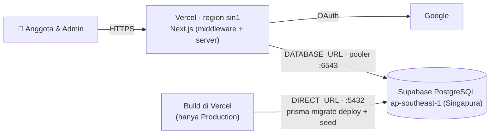

# Subuh Tracker — Panduan Deployment

> Phase 9 deliverable. Target: **Vercel (Hobby, gratis)** + **Supabase PostgreSQL (Free)** + **Google OAuth**.
> Perkiraan waktu: 45–60 menit untuk deploy pertama.



## Daftar isi

1. [Prasyarat](#1-prasyarat)
2. [Siapkan repository GitHub](#2-siapkan-repository-github)
3. [Supabase production](#3-supabase-production)
4. [Google OAuth untuk domain production](#4-google-oauth-untuk-domain-production)
5. [Vercel: import & environment variables](#5-vercel-import--environment-variables)
6. [Deploy pertama & verifikasi](#6-deploy-pertama--verifikasi)
7. [Buka aplikasi untuk semua anggota](#7-buka-aplikasi-untuk-semua-anggota)
8. [Domain sendiri (opsional)](#8-domain-sendiri-opsional)
9. [Operasional sehari-hari](#9-operasional-sehari-hari)
10. [Troubleshooting](#10-troubleshooting)
11. [Batas paket gratis](#11-batas-paket-gratis)

---

## 1. Prasyarat

| Akun | Kegunaan |
|---|---|
| GitHub | Menyimpan source code; Vercel deploy otomatis dari sini |
| Vercel (login dengan GitHub) | Hosting aplikasi |
| Supabase | Database PostgreSQL |
| Google Cloud (project dari Phase 4) | Login Google |

Di komputer lokal: Node.js ≥ 20.9, Git, dan project ini yang sudah lolos `npm run test:all`.

## 2. Siapkan repository GitHub

1. Buat repository **private** baru di GitHub, misalnya `subuh-tracker`. Jangan centang "Add README".
2. Di folder project:

   ```bash
   git add -A
   git status              # pastikan .env TIDAK ikut (harus sudah di-ignore)
   git commit -m "Subuh Tracker v1"
   git branch -M main
   git remote add origin https://github.com/<username>/subuh-tracker.git
   git push -u origin main
   ```

3. Buka tab **Actions** di GitHub. Workflow **CI** (lint, typecheck, unit test, build) akan berjalan dan harus hijau.

> ⚠️ Pastikan `.env` tidak pernah masuk git. `git check-ignore .env` harus mencetak `.env`.

## 3. Supabase production

Gunakan **project terpisah** dari development, agar data test tidak bercampur dengan data asli.

1. https://supabase.com/dashboard → **New project**
   - **Name:** `subuh-tracker-prod`
   - **Database password:** klik *Generate a password*. Password yang hanya berisi huruf & angka menghindari masalah URL-encoding (lihat Phase 3). Simpan di password manager.
   - **Region:** **Southeast Asia (Singapore)**, paling dekat ke Indonesia.
   - Plan: Free → **Create new project** (± 2 menit).
2. Klik **Connect** (tombol di atas) → tab **ORMs** → **Prisma**. Ambil dua connection string:

   | Nama di Supabase | Port | Dipakai sebagai |
   |---|---|---|
   | **Transaction pooler** | 6543 | `DATABASE_URL`, tambahkan `?pgbouncer=true&connection_limit=5` |
   | **Session pooler** | 5432 | `DIRECT_URL` (untuk migration) |

   Contoh:
   ```
   DATABASE_URL="postgresql://postgres.<ref>:<password>@aws-0-ap-southeast-1.pooler.supabase.com:6543/postgres?pgbouncer=true&connection_limit=5"
   DIRECT_URL="postgresql://postgres.<ref>:<password>@aws-0-ap-southeast-1.pooler.supabase.com:5432/postgres"
   ```

   > Jangan pakai *Direct connection* (`db.<ref>.supabase.co`) untuk `DIRECT_URL`. Di paket Free alamat itu hanya IPv6, sedangkan build Vercel memakai IPv4. Session pooler (5432) aman untuk `prisma migrate`.

3. **Tabel tidak perlu dibuat manual.** Migration (termasuk RLS) dan seed program "Subuh Berjamaah" dijalankan otomatis oleh build Vercel pada deploy Production pertama (§6).

**Region lain?** Kalau Anda memilih region selain Singapura, samakan region Vercel di `vercel.json`:

| Supabase | `vercel.json` → `regions` |
|---|---|
| Southeast Asia (Singapore) `ap-southeast-1` | `["sin1"]` *(default di repo)* |
| Northeast Asia (Seoul) `ap-northeast-2` | `["icn1"]` |
| Northeast Asia (Tokyo) `ap-northeast-1` | `["hnd1"]` |

## 4. Google OAuth untuk domain production

Domain Vercel diketahui setelah import (§5), biasanya `https://subuh-tracker.vercel.app` atau `https://subuh-tracker-<acak>.vercel.app`. Setelah domain didapat:

1. https://console.cloud.google.com → project **Subuh Tracker** → **Google Auth Platform** → **Clients** → klik client **Subuh Tracker Web**.
2. **Authorized JavaScript origins** → *Add URI*: `https://<domain-anda>`
3. **Authorized redirect URIs** → *Add URI*: `https://<domain-anda>/api/auth/callback/google`
4. **Save**. Biarkan URI `localhost:3000` yang lama tetap ada untuk development.

Client ID dan Client secret **tetap sama** dengan yang di `.env` lokal.

> Perubahan di Google kadang baru berlaku 5 menit sampai beberapa jam. Kalau langsung muncul `redirect_uri_mismatch`, tunggu sebentar lalu coba lagi.

## 5. Vercel: import & environment variables

1. https://vercel.com/new → **Import** repository `subuh-tracker`.
2. **Framework Preset:** Next.js (terdeteksi otomatis). **Build Command** biarkan default. `vercel.json` sudah mengatur `npm run vercel-build`.
3. Buka **Environment Variables** dan isi tabel berikut **sebelum** klik Deploy:

| Variable | Production | Preview | Nilai |
|---|---|---|---|
| `DATABASE_URL` | ✅ | ✅ | Production: pooler 6543 project **prod**. Preview: project **dev**. |
| `DIRECT_URL` | ✅ | ✅ | Session pooler 5432 dari project yang sama |
| `AUTH_SECRET` | ✅ | ✅ | **Baru dan berbeda** dari lokal. Buat dengan `npx auth secret` atau `openssl rand -base64 32`. |
| `AUTH_GOOGLE_ID` | ✅ | ✅ | Sama dengan `.env` lokal |
| `AUTH_GOOGLE_SECRET` | ✅ | ✅ | Sama dengan `.env` lokal (tandai **Sensitive**) |
| `ADMIN_EMAILS` | ✅ | ✅ | Email admin awal, dipisah koma |
| `APP_TIMEZONE` | opsional | opsional | Default `Asia/Jakarta` |

Catatan:
- **Jangan isi `AUTH_URL`** di Vercel. Auth.js mendeteksi domain Vercel otomatis. `AUTH_URL` hanya untuk lokal.
- Tandai `DATABASE_URL`, `DIRECT_URL`, `AUTH_SECRET`, `AUTH_GOOGLE_SECRET` sebagai **Sensitive**.
- **Preview** (build dari branch/PR) butuh env agar build berhasil. Arahkan ke database **dev**. Build Preview **tidak** menjalankan migration (`scripts/vercel-build.mjs`). Login Google di URL Preview tidak akan jalan kecuali URL-nya didaftarkan di Google. Pakai Preview untuk cek tampilan saja.

4. Klik **Deploy**.
5. Setelah domain Production muncul, lakukan §4 (daftarkan domain di Google).

## 6. Deploy pertama & verifikasi

### 6.1 Periksa build log

Vercel → project → **Deployments** → deployment teratas → **Building**. Urutannya harus seperti ini:

```
[vercel-build] $ npx prisma generate
[vercel-build] $ npx prisma migrate deploy
  Applying migration `20260927074004_init`
  Applying migration `20260927074034_security_hardening`
  All migrations have been successfully applied.
[vercel-build] $ npx prisma db seed
  ✔ program "Subuh Berjamaah" (subuh-berjamaah) — active: true
[vercel-build] $ npx next build
  ✓ Compiled successfully
```

Peringatan `A Node.js API is used (CompressionStream …) jose … Edge Runtime` **aman diabaikan**. Asalnya dari library JWT milik Auth.js untuk fitur kompresi yang tidak dipakai.

### 6.2 Smoke test otomatis (dari komputer lokal)

```bash
npm run smoke -- https://<domain-anda>
```

Tes ini hanya membaca dan tidak membuat data. Hasilnya harus `20/20 checks passed`. Pada HTTPS ada 2 cek tambahan (HSTS dan cookie Secure) dibanding localhost.

> Jangan jalankan `npm run test:e2e` terhadap production. E2E membuat data fixture di database dari `.env` lokal (dev).

### 6.3 Checklist manual

| # | Langkah | Harus terjadi |
|---|---|---|
| 1 | Buka `https://<domain>` di HP | Diarahkan ke halaman login hijau |
| 2 | Login dengan email di `ADMIN_EMAILS` | Masuk dashboard, badge **Admin**, menu Pengurus ada |
| 3 | **Lapor** → Berjamaah → Kirim | "Anda sudah mengisi laporan hari ini", tanggal = hari ini (WIB) |
| 4 | **Statistik** → pindah bulan dengan panah | Bulan berganti (bukti navigasi query berfungsi di production) |
| 5 | Admin → **Anggota** → cari nama → **Export CSV** | CSV terunduh, terbuka rapi di Excel/Sheets |
| 6 | Login dengan akun Google lain | Masuk sebagai anggota; `/admin/dashboard` dikembalikan ke beranda |
| 7 | Menu browser → **Add to Home Screen** | Ikon bulan-bintang hijau, terbuka tanpa address bar |

Laporan dari langkah 3 adalah data asli. Biarkan, atau minta anggota mulai mengisi keesokan harinya.

## 7. Buka aplikasi untuk semua anggota

Selama status app Google masih **Testing**, hanya *test user* yang bisa login.

1. Google Cloud → **Google Auth Platform** → **Audience** → **Publish app** → **Confirm**.
2. Karena scope yang dipakai hanya `openid`, `email`, dan `profile`, **tidak ada review dari Google**.
3. **Jangan upload logo aplikasi** di halaman Branding. Upload logo memicu proses verifikasi brand yang bisa memakan waktu berhari-hari. Nama aplikasi cukup "Subuh Tracker".
4. Bagikan link ke anggota. Setiap anggota otomatis terdaftar sebagai **USER** saat login pertama.

Menambah admin berikutnya: login sebagai admin → **Anggota** → buka anggota → **Jadikan admin**. Tidak perlu redeploy atau mengubah `ADMIN_EMAILS`.

## 8. Domain sendiri (opsional)

1. Vercel → project → **Settings → Domains** → *Add* `subuh.asrama-anda.id` → ikuti instruksi DNS (CNAME ke `cname.vercel-dns.com`).
2. Tambahkan domain baru di Google OAuth (§4): origin **dan** redirect URI.
3. Jalankan ulang `npm run smoke -- https://subuh.asrama-anda.id`.

## 9. Operasional sehari-hari

### Rilis perubahan

```bash
git push                    # ke main → Vercel otomatis deploy Production
```

Setiap push ke `main` menjalankan CI di GitHub dan deploy di Vercel. Deploy Production menerapkan migration baru secara otomatis.

### Mengubah struktur database

1. Ubah `prisma/schema.prisma`.
2. Lokal (database dev): `npm run db:migrate -- --name deskripsi_perubahan`. Ini membuat folder baru di `prisma/migrations/`.
3. `npm run test:all`, lalu commit **termasuk folder migration** dan push. Production menerapkannya saat build.

> Migration hanya maju. Kalau perlu membatalkan, buat migration baru yang membalik perubahan. Jangan menghapus atau mengubah migration yang sudah diterapkan.

### Rollback

Vercel → **Deployments** → deployment lama yang sehat → **⋯ → Promote to Production** (instant rollback). Database **tidak** ikut mundur. Rollback kode aman selama kode lama masih cocok dengan schema terbaru (penambahan kolom/tabel aman; penghapusan kolom perlu hati-hati).

### Log & error

Vercel → project → **Logs**. Filter `Error` untuk melihat error server. Pesan error ke pengguna tetap generik; detail teknis hanya ada di log ini dan di kode `digest` pada halaman error.

### Backup

- Admin bisa **Export CSV** kapan saja (per program, per bulan).
- Backup penuh (butuh PostgreSQL client tools di komputer):

  ```bash
  pg_dump "<DIRECT_URL production>" --schema=public --no-owner --file=subuh-backup-$(date +%F).sql
  ```

  Paket Free Supabase tidak menyediakan restore mandiri dari dashboard. Lakukan backup di atas secara berkala, misalnya setiap awal bulan.

### Rotasi secret

- `AUTH_SECRET` diganti → semua anggota ter-logout (perlu login ulang). Data tetap aman.
- Password database diganti di Supabase → perbarui `DATABASE_URL` dan `DIRECT_URL` di Vercel → **Redeploy**.
- Setelah mengubah environment variable apa pun di Vercel, lakukan **Redeploy** agar berlaku.

## 10. Troubleshooting

| Gejala | Penyebab | Solusi |
|---|---|---|
| `Error 400: redirect_uri_mismatch` | Domain belum/ salah didaftarkan di Google | §4: `https://<domain>/api/auth/callback/google` persis sama (https, tanpa `/` di akhir). Tunggu hingga beberapa menit. |
| "Access blocked: app has not completed verification" | App masih *Testing* dan email bukan test user | §7 Publish app, atau tambahkan email sebagai test user |
| Halaman login: "Login sedang bermasalah" (`Configuration`) | `AUTH_SECRET`/`AUTH_GOOGLE_*` kosong atau salah di Vercel | Periksa env Production → Redeploy |
| Build gagal: `Environment variable tidak valid: …` | Env belum diisi untuk environment tersebut (Production/Preview) | Isi sesuai §5 → Redeploy |
| Build gagal: `DIRECT_URL is required …` | `DIRECT_URL` tidak di-set untuk Production | Tambahkan session pooler 5432 |
| `prisma migrate deploy` lama lalu gagal (`P1001`/timeout) | `DIRECT_URL` memakai port 6543 atau alamat Direct IPv6 | Gunakan **Session pooler 5432** |
| Error `prepared statement "s0" already exists` | `DATABASE_URL` tanpa `pgbouncer=true` | Tambahkan `?pgbouncer=true&connection_limit=5` |
| `P1001 Can't reach database server` saat pemakaian | Project Supabase **ter-pause** (tidak aktif ± 1 minggu) | Supabase dashboard → **Restore project**; lihat §11 |
| Login berhasil tapi langsung kembali ke login ("Sesi tidak berlaku") | Akun dinonaktifkan admin, atau user dihapus dari DB | Admin → Anggota → filter **Nonaktif** → Aktifkan kembali |
| Tanggal laporan terasa salah hari | `APP_TIMEZONE` diubah | Hapus variabel (default `Asia/Jakarta`) → Redeploy |
| Halaman lambat pertama kali dibuka pagi hari | Cold start fungsi serverless | Normal (1–2 detik), request berikutnya cepat |

## 11. Batas paket gratis

| Layanan | Batas yang relevan | Dampak untuk asrama |
|---|---|---|
| **Supabase Free** | 500 MB database; **project di-pause setelah ± 1 minggu tanpa aktivitas**; 2 project gratis per akun | 1 laporan ≈ < 1 KB, sehingga ratusan anggota selama bertahun-tahun tetap jauh di bawah 500 MB. Saat libur panjang, project bisa ter-pause: buka dashboard Supabase → *Restore*. Data tidak hilang. |
| **Vercel Hobby** | Untuk penggunaan non-komersial; kuota function & bandwidth bulanan | Pemakaian harian asrama jauh di bawah kuota. Kalau aplikasi dipakai secara komersial, upgrade ke Pro. |
| **Google OAuth** | Scope dasar tanpa verifikasi; 100 test user selama *Testing* | Publish app (§7) agar semua akun bisa login |

Batas bisa berubah. Cek halaman *pricing* resmi masing-masing layanan sebelum rilis.
